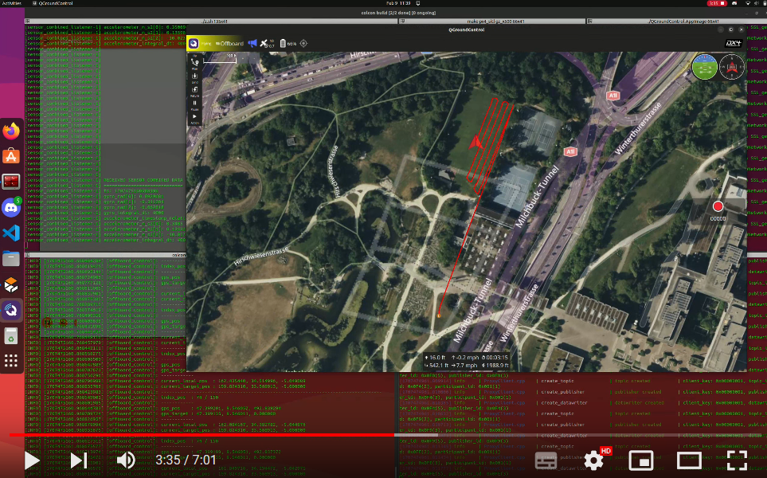

# Autonomous Reforestation Drone
## *A project by Kariboo*

**Description:** Implementing autonomous behaviours for a drone to be able to reforest any given area without teleoperating.

[📖 User documentation](docs/user) • [👨‍💻 Developer documentation](docs/developer) • [📈 Project report](docs/report) • [📚 Bibliography](docs/bibliography)

## 📄 This project in short

This project, led by Julien GENESTE, was created in response to the many fires in Gironde and more generally in France. It follows on from the [POCDroneReforestation](https://github.com/Kariboo-Corp/POCDroneReforestation) project, in which an **Unmanned Aerial Vehicle** (UAV) equiped with a **seed cannon** was developped. At that point, the drone would only be teleoperated. The [1$^{st}$ video](https://youtu.be/yf7zY1jwji8) shows the results of that project, i.e. our starting point.

The idea of this project is to make the drone autonomous using the middleware [ROS 2 (Humble)](https://docs.ros.org/en/humble/index.html). The objectives are as follows:
- Find a way to **precisely locate** the drone at all times during the planting process
- Make the drone **aware of its environment** using the proper sensors. (Is the terrain suitable for planting? Are there obstacles?)
- **Generate a trajectory** to accomplish the mission, ensuring it is as **efficient** as possible.

In brief, we use **RTK** to locate the drone, a **3D camera** to detect obstacles beneath the drone and we define a **Back and Forth Path (BFP)** to cover the area. The [2$^{nd}$ video](https://www.youtube.com/watch?v=FuNU0X7J_0g) presents an example of a trajectory generated by our algorithms.

More insight into our solutions and results can be found in the [Project Report](docs/report).

## 🔍 About this project

|                        |                        |
| :--------------------: | :--------------------: |
| 💼 **Client** | Julien GENESTE |
| 🔒 **Confidentiality** | **Public** |
| 👨‍👨‍👦 **Authors** | [Camille PARRATT](https://www.linkedin.com/in/camille-parratt/) , [Margo BIRET](https://www.linkedin.com/in/margo-biret/) , [Théodore GIGAULT](https://www.linkedin.com/in/theodoregi/), [Lucas GAVERIAUX](https://www.linkedin.com/in/lucasgaveriaux/) |