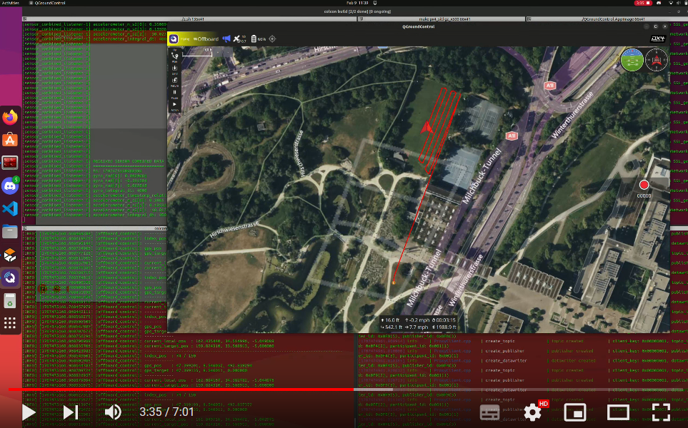

# 📖 User documentation

[](https://youtu.be/yf7zY1jwji8)

This section describes the process to follow in order to obtain a result such as the one presented in [the video above](https://www.youtube.com/watch?v=FuNU0X7J_0g). 

⚠️ **Note :** Be aware that we are working with **global GPS coordinates**, which means that if you ask the drone to plant trees in Australia from France, it will probably do it. By default, in the simulation, the drone takes off in Zurich Switzerland, Irchel Park. It might be advised to do the tests in that area, or to change the take-off location accordingly.

## ✅ Prerequisites

You will need to install the following libraries/programs for our tests to work:

- [**OpenCV**](https://opencv.org/releases/): A library of programming functions mainly aimed at real-time computer vision.
- [**GeographicLib**](https://geographiclib.sourceforge.io/): A library for geographic projections and geodesic calculations.
- [**QGroundControl**](https://docs.qgroundcontrol.com/master/en/qgc-user-guide/getting_started/download_and_install.html): A user-friendly ground control station for the configuration and operation of UAVs.

## 📁 Installing the project

To install the project, simply clone this repository :
```
git clone https://github.com/LGLucasG/AutonomousReforestationDrone/ --recursive
```
The `--recursive` option is crucial as it initializes and updates each submodules in the repository (including nested submodules). Submodules are located in the [src](src) folder:
- [**PX4-Autopilot**](https://github.com/PX4/PX4-Autopilot): An open-source flight control software for drones and other unmanned vehicles.
- [**Micro-XRCE-DDS-Agent**](https://github.com/eProsima/Micro-XRCE-DDS-Agent.git): Acts as a server that connects these lightweight clients to a standard DDS network or service. Alternative to MavROS.

If you forgot to use the `--recursive` option when cloning, you can still use the command `git submodule update --init --recursive` to initialize and update the submodules. You can find more information about submodules [here](https://git-scm.com/book/en/v2/Git-Tools-Submodules).

Last but not least, **do not forget to source all the necessary setup files** ! Adapt the following commands according to your installation. We recommand putting them in your `.bashrc` and avoiding relative paths.

```
source /opt/ros/humble/setup.bash
source <absolute_path_to_the_repo>/src/ws_controller/install/setup.bash
source <...>/src/ws_controller/install/loacl_setup.bash
source <...>/src/PX4-Autopilot/Tools/simulation/gazebo-classic/setup_gazebo.bash
source <...>/src/PX4-Autopilot/build/px4_sitl_default/
```

## Using the Lidar

First, the LIDAR must be properly connected to the Raspberry Pi :

*Insert image with connections here*

Once connected, `cd` into an existing ROS2 workspace and then into the `src` folder, or create a workspace with :
```
mkdir lidar_ws
cd lidar_ws
mkdir src
cd src
```
Download the [LIDAR package](src/lidar_pkg) and move back into the workspace with `cd ..`. Build the workspace with `colcon build` then source the `bashrc`. 

To launch the node, use the command : `ros2 run lidar_pkg lidar_node`

The topic should start publishing every second a message with the distance to the nearest obstacle.


## 〽️ Path Generation

### Compute an Optimal Back-and-Forth Path for a Field

This guide outlines the steps to compute an optimal back-and-forth (BFP) path for a specified field area. Follow these steps carefully to achieve accurate results.

#### Process Overview

1. **Prepare the Field Image**:
    - Obtain an image of the field. A screenshot from Google Maps can serve this purpose effectively. Place the image within the `bfp_generation/` directory. Note that all images located in `bfp_generation/img/` have undergone testing.
    - Identify and record the GPS coordinates of two distinct points on this image. Save these coordinates in a file named `gps_keypoints.csv`.

2. **Build the Software**:
    Open a new terminal and execute the following commands to compile the program:
    ```
    mkdir build/
    cd build/
    cmake ..
    make
    ```

3. **Run the Main Program**:
    Execute the compiled program by running:
    ```
    ./main
    ```

4. **Interact with the Program**:
    - Click on the corner of the field within the program's graphical interface.
    - Press `<Enter>` to initiate the computation of the BFP and verify its correctness.
    - Select the two points (previously noted in `gps_keypoints.csv`) on the image to compute the BFP accurately.

5. **Save the Computed Path**:
    - The program will generate and save the back-and-forth path points in a file named `bfp_gps.csv`.

6. **Transfer the Computed Path**:
    - Execute the following command to copy the `bfp_gps.csv` file into your workspace:
    ```
    ../cp_tows.sh
    ```

**CSV File Format**

Ensure that gps_keypoints.csv file adhere to the following format:

```
latitude, longitude
45.189..., 8.159...
```

## 🛫 Ready for Takeoff !

Once everything is set up, you will need 5 different terminals to run the simulation and visualize the drone's trajectory in real-time.

1. Start **MicroXRCEAgent** with the command: 
```
MicroXRCEAgent udp4 -p 8888
```

2. Launch the **QGroundControl** image
```
./QGroundControl.AppImage
```

3. Go to the **PX4-Autopilot** directory and launch it with the command:
```
make -j32 px4_sitl gz_x500
```

4. Launch the **ROS sensor_combined node**:
```
ros2 launch px4_ros_com sensor_combined_listener.launch.py
```

5. Wait for sensor data reception in terminal 4, then launch the **drone controller** with:
```
ros2 run px4_ros_com offboard_control
```
